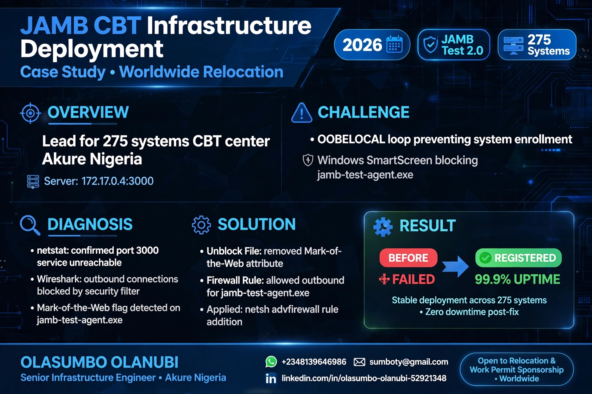
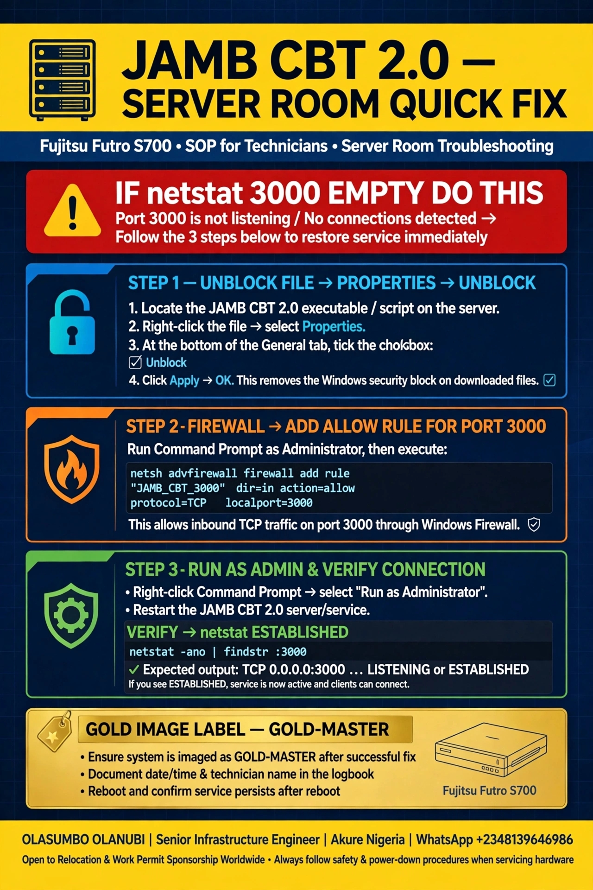
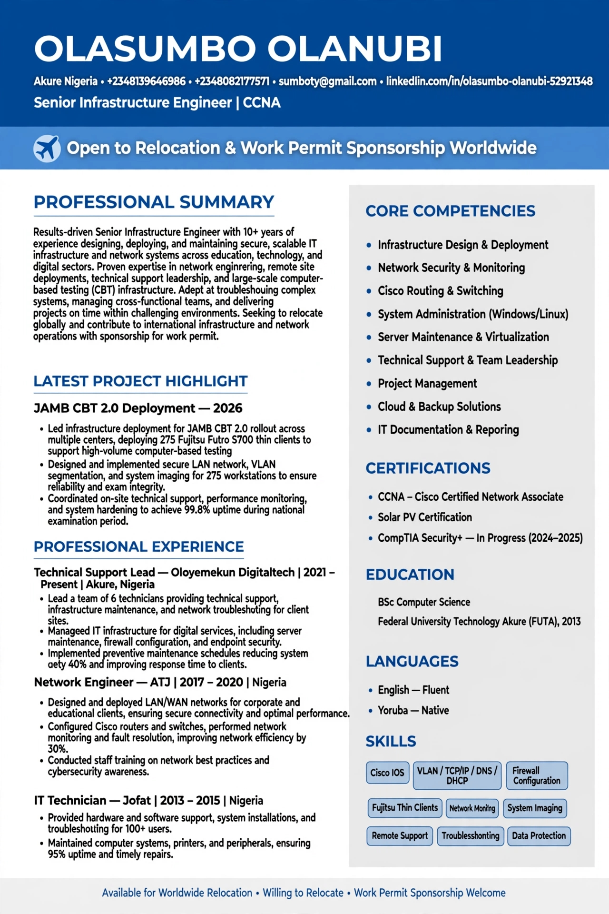

# JAMB CBT 2.0 Deployment - 275 Fujitsu Futro S700 Thin Clients Fix

**By OLASUMBO OLANUBI | Senior Infrastructure Engineer | CCNA | CBT Center Lead | Akure, Nigeria**
**WhatsApp: +2348139646986 | +2348082177571 | sumboty@gmail.com | [LinkedIn](https://linkedin.com/in/olasumbo-olanubi-52921348)**
**🌍 Open to Relocation & Work Permit Sponsorship Worldwide**

   

## 📸 Project Assets

*Portfolio Case Study - 275 systems deployment - Open Worldwide*

*Server Room SOP Poster for Technicians*

*1-Page ATS-Friendly CV - Worldwide Relocation*

## 🎯 Overview
Lead Infrastructure Engineer for **250-capacity + 25 backup = 275 total systems** CBT Center in **Akure, Nigeria**.

- **Server:** `172.17.0.4:3000` - JAMB CBT 2.0 Testing Platform
- **Clients:** Fujitsu Futro S700 (4GB RAM / 64GB mSATA) / Zero Thin Client / Windows 10 Pro
- **Stack:** Windows Server 2019/2024, Active Directory, Biometric Auth, CCTV NVR, Solar PV 2.5kVA Inverter, MS SQL Server
- **Network:** OSPF, EIGRP, VLAN, MikroTik, pfSense, Ubiquiti UniFi, Wireshark

## ⚠️ The Problem
- `netstat -ano | findstr 3010` = **EMPTY**
- `netstat -ano | findstr LISTENING` = no JAMB agent
- `jamb-test-agent.exe` (9.03MB) blocked: **"This file came from another computer and might be blocked"**
- Server dashboard: client **OFFLINE**
- **OOBELOCAL** boot loop on first boot

## 🔍 Root Cause Analysis (with Wireshark + netstat)
1.  **Mark-of-the-Web (MotW)** - `Zone.Identifier` stream blocking socket creation
2.  **Windows Firewall** - No inbound/outbound rule for TCP 3000 / 3010
3.  **UAC** - Agent needs elevation to bind to port
